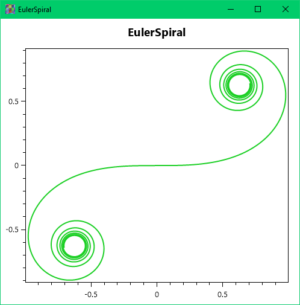

# t2g

Text to graph application. Allows you to visualize JSON data as an XY-chart.

### Usage

Use the context menu to load, save files, export SVG and PNG images and more.

Also pass the path to the JSON file as the first command line parameter to open it.

Click the default chart to draw a new chart if no file path is provided;

the Euler spiral or the random Lissajous figure will be drawn as examples.

Save the file and open it in a text editor to understand the structure of the JSON file.

Zoom in/out using the mouse wheel.

The [.NET 6.0 Framework Runtime](https://dotnet.microsoft.com/en-us/download/dotnet/6.0) is required to execute the code.

Uses popular [OxyPlot](https://github.com/oxyplot/oxyplot), [Newtonsoft.Json](https://github.com/JamesNK/Newtonsoft.Json) and [Math.NET Numerics](https://github.com/mathnet/mathnet-numerics) third-party software, see licenses attached.

Cheers!
